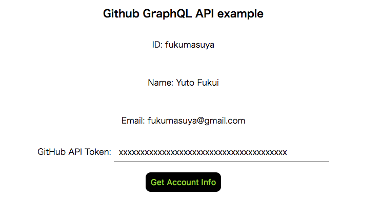

React + Redux + GraphQL example
====

This is a React + Redux + GraphQL simple example. This example call Github GraphQL API and get account information.
Only you need to do is putting your Github API token and clicking "Get" button!

## Description
This application uses [Redux-Saga](https://github.com/redux-saga/redux-saga) to handle calling Github GraphQL API. Redux-Saga aims to handle side effects(e.g. Ajax calls) in Redux applications.

This project is created by using [Create React App](https://github.com/facebookincubator/create-react-app) CLI. Create React App includes [Jest](https://github.com/facebook/jest) as a JS test framework by default. You don't have to add a test framework to this project. Maybe you want to add [Enzyme](https://github.com/airbnb/enzyme) for React test utility.

## Screen shots


## Requirement
- `yarn`

## Install
```bash
$ yarn
```

## Usage
```bash
$ yarn start
```
then, open http://localhost:3000/

## Licence
MIT
